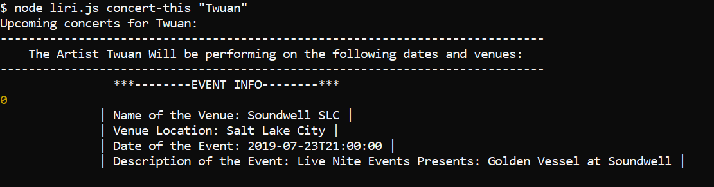
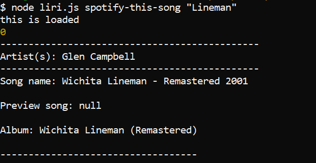
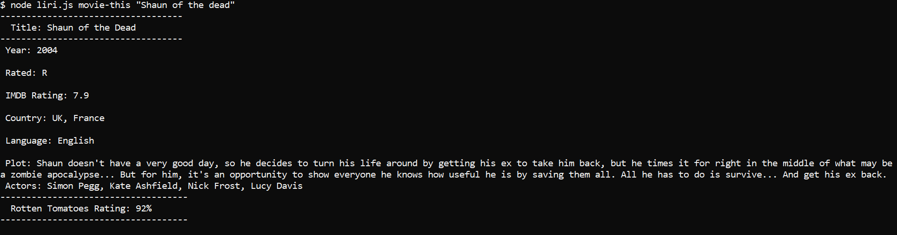
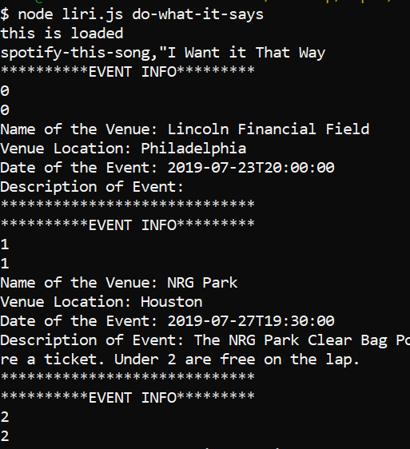

# liri-node-application
 https://github.com/Lrop/liri-node-application
 

## Requirements

LIRI will search Spotify for songs, Bands in Town for concerts, and OMDB for movies.
To retrieve the data that will power this app, you'll need to send requests using the axios package to the Bands in Town, Spotify and OMDB APIs. 

You'll find these Node packages crucial for your assignment.

## Technologies

1. Javascript
2. Node.js
3. Node packages:
Node-Spotify-API,
 Request,
 Moment,
 DotEnv
4. APIs used:
Bands in Town,
 OMDB
5. Git
6. GitHub

You'll use Axios to grab data from the OMDB API and the Bands In Town API.

## How to use Liri-Node Application 

1. Open your Terminal command line (Gitbash, CMDER, Terminal, etc)

2. Navigate inside of the command line to the folder that contains liri.js

3. Enter one of four commands such as:

- concert-this
- spotify-this-song
- movie-this
- do-what-it-says

#### Example One:
`node liri.js concert-this "name of artist or band"`

##### Output
Displays a list of all current events and locations of where the artist or band will be performing.The application will also log all the results in the log.txt file. 

#### Example Two:

##### Output
Displays information about the selected song name. It can result in multiple records dependent on how common place the song name is.The application will also log all the results in the log.txt file. 

`node liri.js spotify-this-song "name of tune"`

#### Example Three:

##### Output
Displays information associated with the users desired movie. The application will also log all the results in the log.txt file. 

`node liri.js movie-this "name of movie"`

#### Example Four:

##### Output
The application will read the text in the random.txt file.

